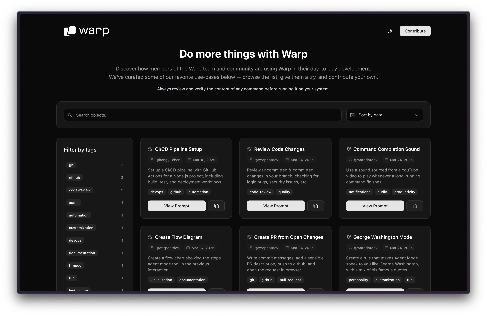

# Do Things with Warp

<p align="center">
    <a href="https://app.warp.dev/get_warp">
    
    </a>
</p>

<p align="center">
  <a href="https://www.warp.dev">Website</a>
  ·
  <a href="https://docs.warp.dev">Docs</a>
  ·
  <a href="https://docs.warp.dev/getting-started/getting-started-with-warp">Install Guide</a>
  ·
  <a href="https://www.warp.dev/blog/how-warp-works">How Warp Works</a>
</p>

## Introduction

Welcome to the Do Things with Warp repository! This is a community-driven collection of practical prompts and examples for [Warp's](https://warp.dev) Agent Mode, as well as [Warp Drive](https://docs.warp.dev/features/warp-drive) objects.

These examples showcase how developers can leverage Warp's AI capabilities to optimize their workflow, automate tedious tasks, and solve common development challenges.

## Live Website

Check out the live website at [dothings.warp.dev](https://dothings.warp.dev) to explore and discover new ways to use Warp.

## Contributing Guidelines

We welcome contributions from the community! Here's how you can contribute:

### How to Submit New Objects

1. **Create a new branch** for your contribution
2. **Create a new entry** by:
   - Copying [duplicate-me.yaml](https://github.com/warpdotdev/do-things/blob/main/public/objects/duplicate-me.yaml) to a new file with a descriptive name (e.g., `my-awesome-pack.yaml`)
   - Fill in all the required fields following the template's comments
   - Make sure to rename the file appropriately before committing
3. **Ensure your entry is:**
   - Clear and concise
   - Provides a real-world use case
   - Includes relevant tags
   - Has appropriate attribution
   - Has a valid Warp Drive link with public sharing enabled
4. **Submit a pull request** to the main branch with a clear description of your object

### Important Notes for Contributors

- The Warp team will review all submissions
- Make sure your Warp Drive object link has sharing turned on for "Anyone with the link can view". To do so, click "Share" on the object and change "Anyone with the link" to "Can View"
- All submissions should be original content or properly attributed
- We reserve the right to modify or reject submissions at our discretion

**Fun Fact**: This entire project was built exclusively using AI tools - specifically Warp's Agent Mode and Dispatch features :)

<p align="center">
    
</p>

## Local Development

If you'd like to contribute or run this project locally, here's how to get started:

### Prerequisites

- Node.js (v20 or higher recommended for Next.js 15)
- npm or yarn
- Git

### Setup Steps

1. Clone the repository (choose one method):

   ```bash
   # Using HTTPS
   git clone https://github.com/warpdotdev/do-things.git

   # Or using SSH
   git clone git@github.com:warpdotdev/do-things.git

   cd do-things
   ```

2. Install dependencies:

   ```bash
   npm install
   # or
   yarn install
   ```

3. Start the development server:

   ```bash
   npm run dev
   # or
   yarn dev
   ```

4. Open your browser and navigate to `http://localhost:3000` to view the website.

## Using Warp Drive Objects

Each example in the collection is a Warp Drive object that you can use directly in Warp. There are four types of objects:

- **Prompts**: Quick commands and instructions for the AI agent
- **Notebooks**: Interactive step-by-step guides with explanations
- **Workflows**: Complex automation sequences
- **Folders**: Collections of related objects

To use any example:

1. Click on the example card to open its Warp Drive link
2. The object will open directly in your Warp
3. Follow the instructions in the object to accomplish your task

> **Important**: Always review and verify the content of any object before running it. While we strive to provide safe and accurate examples, it's important to understand what commands will be executed on your system.

Learn more about Warp Drive objects in our [documentation](https://docs.warp.dev/warp-drive).

## Community and Support

Join our community channels to discuss Warp packs, share tips, and get help:

- [Discord](https://discord.com/invite/warpdotdev) - Join our community for discussions and support
- [X](https://x.com/warpdotdev) - Follow us for updates and announcements
- [YouTube](https://www.youtube.com/@warpdotdev) - Watch tutorials and demos
- [LinkedIn](https://www.linkedin.com/company/warpdotdev) - Connect with the team
- [GitHub](https://github.com/warpdotdev) - Give us feedback and star our projects!

## License

This project is licensed under the MIT License - see the [LICENSE](LICENSE) file for details.
